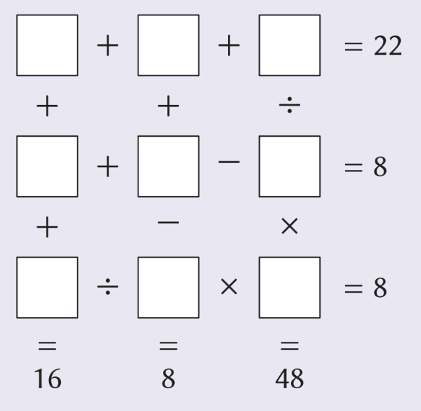
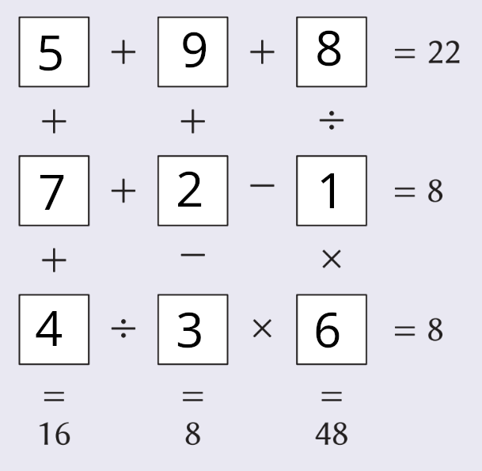

# Sticker book Solver
Aim: automate the process of solving puzzles like this one:



Matthew Scroggs is prone to posting such puzzles in various places, including:
- Chalkdust Magazine puzzle pages
- mscroggs.co.uk Advent calendar
- Puzzle Village puzzles from his puzzle_solver webpage, i.e. http://mathoffstickerbook.com/sync/ehaftEyG7fPRFQE0ZJNG

## Puzzle solver
Currently, the solver is CLI-only.

### How to install
Clone the repo:
```shell
git clone https://github.com/SmokyFurby/stickerbook.git
```
E.g. if the repo folder is called `stickerbook`, run
```shell
cd stickerbook
```

then install the solver package with
```shell
pip install -e .
```

### Inputting the desired puzzle
Enter the 3 rows and 3 columns in your txt file e.g. "+ + 11" for a row or column saying: ? + ? + ? = 11

So the puzzle in the above image would be saved as follows at `./puzzle/input.txt`:
```
+ + 22
+ - 8
/ * 8
+ + 16
+ - 8
/ * 48
```

### How to run
E.g. if the puzzle txt is at `./puzzle/input.txt`, 

cd to repo folder (if not already) and run:
```shell
python ./scripts/main.py --puzzle_path="./puzzle/input.txt"
```
Note: Windows users may need to replace `python` with `py` or `python.exe`.

#### Output
The script should print some text on the terminal, something like:
```
Inputted puzzle:
+ + 22
+ - 8
/ * 8
+ + 16
+ - 8
/ * 48
The solution is:
5 9 8
7 2 1
4 3 6
```
"Inputted puzzle" repeats the inputted txt so the user can check for any typos.

The numbers below the line saying `The solution is:` tells you how to arrange the digits 1-9 to make all six equations in the puzzle correct. For this example, the digits would be filled in as follows:


